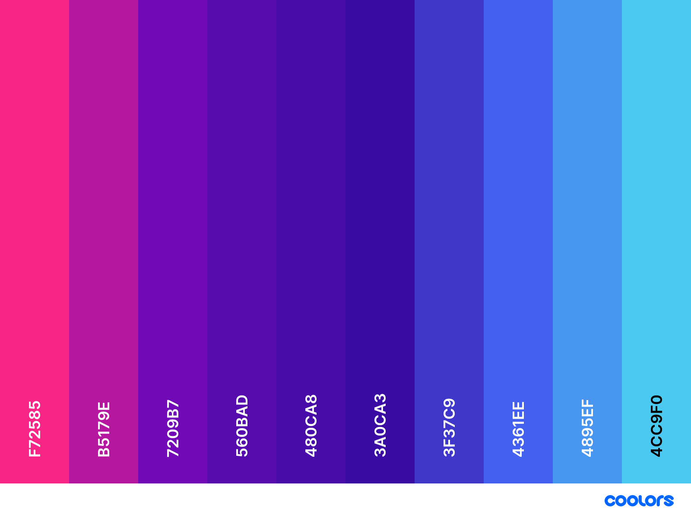

<h1 align="center">Shoutout Generator</h1>

[View the deployed site here](https://adowlin.github.io/shoutout-generator/)

Shoutout! is a site where users can generate wholesome, supportive shoutout messages - either for some personal encouragement, or to share a message of encourgement with someone else.This project was created as part of the [2021 SheSharp Hackathon](https://www.shesharp.co/2021-hackathon). 

## Design
### Wireframe:
- Wireframe created using [Balsamiq](https://balsamiq.com/): 
    

### Color Scheme:
- Generated using [coolors.co](https://coolors.co/): 
    

### Typography:
- Intro Script font sourced from: https://www.fontfabric.com/fonts/intro-script/
- Carlo Melow Sans font sourced from: https://www.dafont.com/carlo-melow-sans.font

### Background Image:
- Created using [Adobe Illustrator](https://www.adobe.com/products/illustrator.html): 
    

## Technologies Used
### Tools
- [GitPod](https://www.gitpod.io/)
    - Used as the preferred IDE for development.
- [Git](https://git-scm.com/)
    - Used via the Gitpod terminal for version control and to push to GitHub.
- [GitHub](https://github.com/)
    - Used to store the site's code repository.
- [Balsamiq](https://balsamiq.com/)
    - To create the site's wireframes.
- [Adobe Illustrator](https://www.adobe.com/products/illustrator.html)
    - To create the site's background gradient graphic.
- [Techsini](http://techsini.com/multi-mockup/) 
    - To create the mockup image used in the README file.
- [Font Awesome](https://fontawesome.com/)
    - For the site's (non-emoji) icons.

### Front-End Technologies
- [HTML5](https://developer.mozilla.org/en-US/docs/Glossary/HTML5)
- [CSS3](https://developer.mozilla.org/en-US/docs/Web/CSS)
- [JavaScript](https://developer.mozilla.org/en-US/docs/Web/JavaScript)
- [Bootstrap 5.1](https://getbootstrap.com/docs/5.1/getting-started/introduction/)

## Credits
- Glassmorphism CSS effect used on footer adapted from: https://ui.glass/generator/
- Emoji -> Favicon code found here: https://css-tricks.com/emojis-as-favicons/